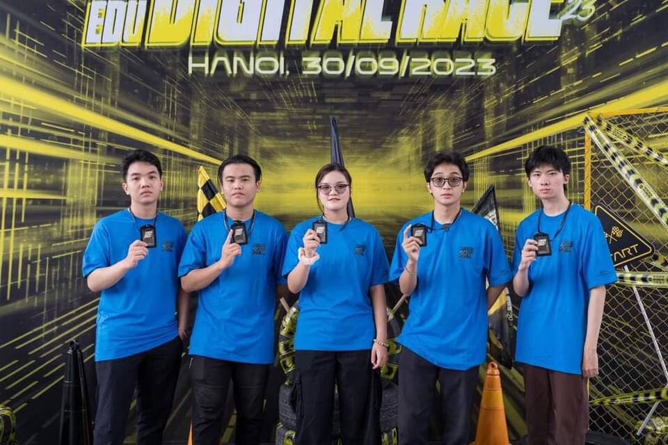
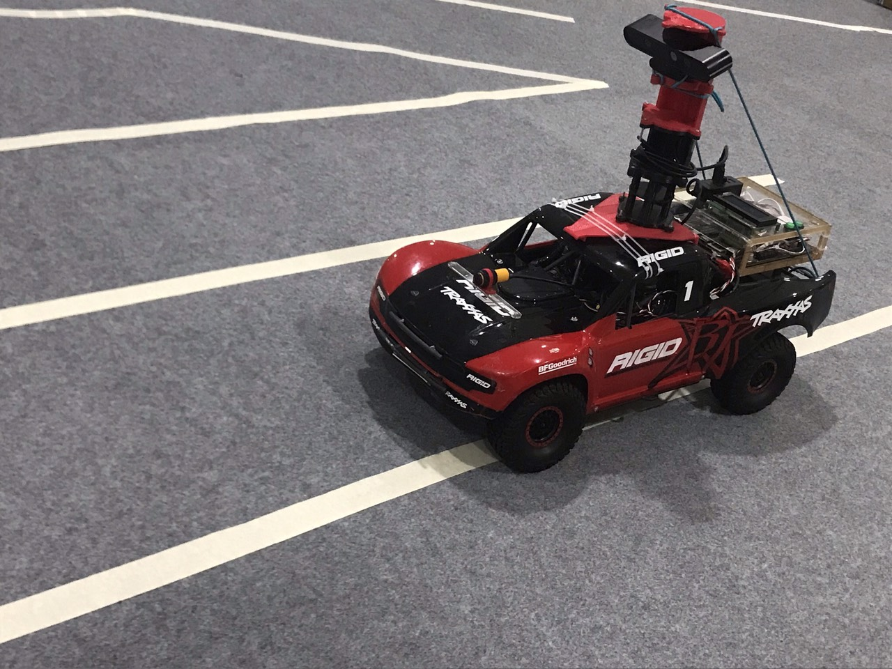
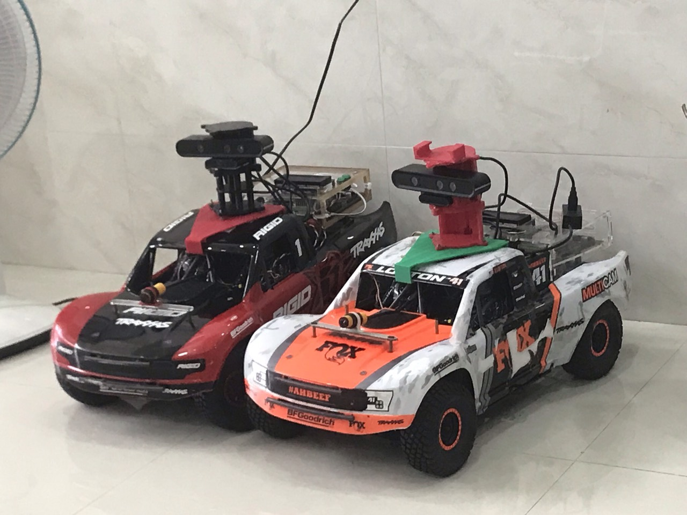

# autonomous_car_2023

This repository is a project for the FPT Digitalcar Contest. We are using PID control and end-to-end steering for lane-keeping, as well as lightweight models for traffic sign and obstacle detection. Afterward, we convert these models to ONNX format and load them using ONNX Runtime GPU. These methods and models are implemented on the Jetson TX2 board.

